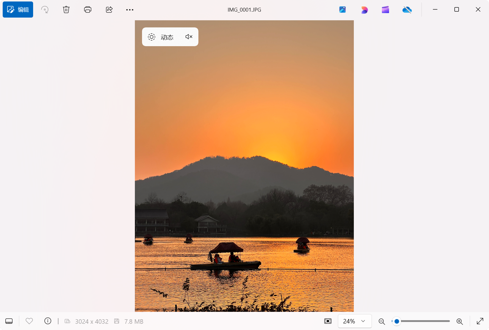

<p align="center">🇨🇳 中文简体  |  <a title="English" href="README_EN.md">🇬🇧 English</a></p>

# 📸 动态照片制作工具

## 介绍

这个Python程序可以将JPG照片和MOV/MP4视频合并为Google Motion Photo（动态照片格式）。合并后，您可以使用Google Pixel手机或Windows 11自带的“[Microsoft 照片](https://www.microsoft.com/store/productId/9WZDNCRFJBH4?ocid=pdpshare)”应用预览动态效果。⭐当然，您也可以使用本程序，将Apple Live Photo转换成Windows可识别的动态照片。

## 特性

- ✨ **支持JPEG和MOV/MP4格式**：支持输入JPEG照片和MOV/MP4视频文件进行处理。
- 🔍 **递归处理**：默认递归处理指定目录中的所有子目录和文件。
- 📝 **元数据添加**：使用 [ExifTool](https://exiftool.org/) 向合并后的文件添加Google Motion Photo所需的XMP元数据。
- 📋 **日志记录**：支持启用详细日志显示，便于调试和查看处理进度。
- 📂 **可选复制未匹配文件**：可以选择将未匹配的文件复制到输出目录。

## 环境要求

- 🐍 Python 3.x
- 📦 [ExifTool](https://exiftool.org/)（如您**使用源代码运行**，需放置在程序同一目录中）

## 使用方法

### 命令行参数

`usage: Motion_Photo_Maker.exe [-h] [-v] [-d DIR] [-p PHOTO] [-m VIDEO] [-o OUTPUT] [-c]`

|     参数    | 缩写  | 描述 |
|     ---     | ---  | --- |
|   `--help`  | `-h` | 显示此命令行参数帮助信息，然后退出程序 |
| `--verbose` | `-v` | 显示日志消息 |
|   `--dir`   | `-d` | 处理包含照片/视频的目录。优先于--photo/--video |
|  `--photo`  | `-p` | 要添加的JPEG照片的路径 |
|  `--video`  | `-m` | 要添加的MOV视频的路径 |
|  `--output` | `-o` | 文件输出路径 |
| `--copyall` | `-c` | 将未匹配的文件复制到目录中 |

> [!NOTE]
> 你必须至少提供`--dir`或同时提供`--photo`和`--video`参数。

### 示例

#### 处理目录中的所有照片和视频

```bash
python script.py -d "C:\Users\admin\Desktop\包含JPG和MOV的文件夹" -o "C:\Users\admin\Desktop\output" -c -v
```

#### 处理单个照片和视频文件

```bash
python script.py -p "C:\Users\admin\Desktop\test\IMG_0000.JPG" -m "C:\Users\admin\Desktop\test\IMG_0000.MOV" -o "C:\Users\admin\Desktop\test\output" -v
```

#### 在Windows中预览



## 文件结构

```plaintext
|-- 📁 exiftool
	|-- 📁 exiftool_files
	|-- exiftool.exe
|-- Motion_Photo_Maker.py
```

`Motion_Photo_Maker.py`是主程序文件，`exiftool.exe`和`📁exiftool_files`是 [ExifTool](https://exiftool.org/) 所需文件，需要放置在程序的同一目录中。

## 工作流程

1. **验证输入**：程序首先验证输入的目录和文件是否存在且有效。
2. **处理文件**：递归遍历指定目录中的所有子目录和文件，找到所有符合条件的照片和视频文件对。
3. **合并文件**：将每对照片和视频文件合并到一个新的文件中。
4. **添加元数据**：使用ExifTool向合并后的文件添加XMP元数据，使其符合Google Motion Photo的格式要求。
5. **复制未匹配文件**（可选）：如果指定了`--copyall`/`-c`参数，将未匹配的文件复制到输出目录。

## 注意事项

> [!IMPORTANT]
> 要处理的图片是**JPG/JPEG**格式，要处理的视频是**MOV/MP4**格式。


> [!WARNING]
> 运行脚本时需要提供必要的命令行参数，否则程序将无法正常运行。

## 项目说明

本项目基于 [MotionPhotoMuxer](https://github.com/mihir-io/MotionPhotoMuxer) 二次开发。

在此版本中，我们进行了以下修改：
- 实现递归处理指定目录中的所有子目录和文件功能
- 改用 [ExifTool](https://exiftool.org/) 处理文件
- 提供中文和English版本

## 许可证

本项目遵循 GPL-3.0 许可证。更多信息请参见 [LICENSE 文件](./LICENSE)。

## ⭐ Star History

[](https://star-history.com/#happycola233/MotionPhotoMaker&Date)