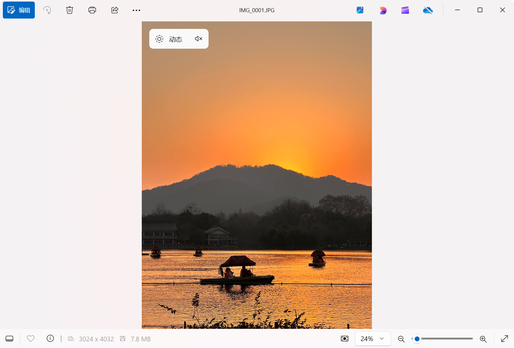

<p align="center"><a title="中文" href="/README.md">🇨🇳 中文简体</a> | 🇬🇧 English</p>

# 📸 Motion Photo Maker

## Introduction

This Python program can merge JPG photos and MOV/MP4 videos into Google Motion Photo format. After merging, you can preview the dynamic effect using a Google Pixel phone or the built-in "[Microsoft Photos(https://www.microsoft.com/store/productId/9WZDNCRFJBH4?ocid=pdpshare)" application in Windows 11. ⭐ Additionally, you can use this program to convert Apple Live Photos into a format recognizable by Windows.

## Features

- ✨ **Supports JPEG and MOV/MP4 formats**: Allows processing of JPEG photos and MOV/MP4 video files.
- 🔍 **Recursive Processing**: By default, processes all subdirectories and files within the specified directory.
- 📝 **Metadata Addition**: Uses [ExifTool](https://exiftool.org/) to add the necessary XMP metadata for Google Motion Photo to the merged files.
- 📋 **Logging**: Supports detailed logging for easier debugging and tracking of the processing progress.
- 📂 **Optional Copy of Unmatched Files**: Allows copying unmatched files to the output directory.

## Environment Requirements

- 🐍 Python 3.x
- 📦 [ExifTool](https://exiftool.org/) (if running from the source code, place it in the same directory as the program)

## Usage

### Command Line Arguments

`usage: Motion_Photo_Maker.exe [-h] [-v] [-d DIR] [-p PHOTO] [-m VIDEO] [-o OUTPUT] [-c]`

|    Argument   |  Short  | Description |
|     ---       |   ---   |   ---       |
|   `--help`    | `-h`    | Show this help message and exit the program |
| `--verbose`   | `-v`    | Display log messages |
|   `--dir`     | `-d`    | Directory containing photos/videos to process. Takes precedence over --photo/--video |
|  `--photo`    | `-p`    | Path to the JPEG photo to be added |
|  `--video`    | `-m`    | Path to the MOV video to be added |
|  `--output`   | `-o`    | File output path |
| `--copyall`   | `-c`    | Copy unmatched files to the output directory |

> [!NOTE]
> You must provide at least `--dir` or both `--photo` and `--video` arguments.

### Examples

#### Process all photos and videos in a directory

```bash
python script.py -d "C:\Users\admin\Desktop\FolderWithJPGsAndMOVs" -o "C:\Users\admin\Desktop\output" -c -v
```

#### Process a single photo and video file

```bash
python script.py -p "C:\Users\admin\Desktop\test\IMG_0000.JPG" -m "C:\Users\admin\Desktop\test\IMG_0000.MOV" -o "C:\Users\admin\Desktop\test\output" -v
```

#### Preview in Windows


## File Structure

```plaintext
|-- 📁 exiftool
    |-- 📁 exiftool_files
    |-- exiftool.exe
|-- Motion_Photo_Maker.py
```

`Motion_Photo_Maker.py` is the main program file, and `exiftool.exe` along with `📁exiftool_files` are the necessary files for [ExifTool](https://exiftool.org/), which need to be placed in the same directory as the program.

## Workflow

1. **Validate Input**: The program first validates whether the input directory and files exist and are valid.
2. **Process Files**: Recursively traverses all subdirectories and files in the specified directory, identifying all matching photo and video file pairs.
3. **Merge Files**: Merges each pair of photo and video files into a new file.
4. **Add Metadata**: Uses ExifTool to add XMP metadata to the merged files to meet Google Motion Photo format requirements.
5. **Copy Unmatched Files** (optional): If the `--copyall`/`-c` argument is specified, copies unmatched files to the output directory.

## Notes

> [!IMPORTANT]
> The photos to be processed must be in **JPG/JPEG** format, and the videos must be in **MOV/MP4** format.

> [!WARNING]
> The script requires the necessary command line arguments to run correctly; otherwise, the program will not function as expected.

## Project Information

This project is based on [MotionPhotoMuxer](https://github.com/mihir-io/MotionPhotoMuxer) and has been further developed.

In this version, we have made the following modifications:
- Implemented recursive processing of all subdirectories and files in the specified directory
- Switched to using [ExifTool](https://exiftool.org/) for file handling
- Provided both Chinese and English versions

## License

This project follows the GPL-3.0 license. For more information, please refer to the [LICENSE file](./LICENSE).

## ⭐ Star History

[](https://star-history.com/#happycola233/MotionPhotoMaker&Date)